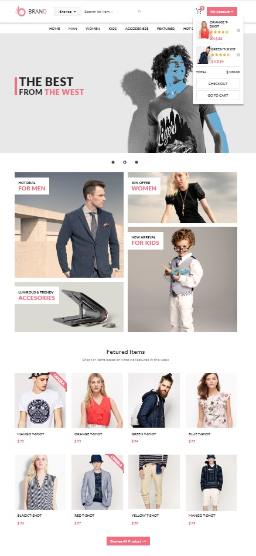

# brand
Проект интернет-магазина Brand
### Особенности
---
- интернет-магазин
- страницы: главная, каталог, один товар, корзина, оформление
- вёрстка flex
- слайдер Slick
- поиск товаров в каталоге
- фронтент на Vue.js + нативный JavaScript
- серверная часть на Node.js + Express
- реализовано REST API (CRUD)
- товары и корзина в файловой БД в формате JSON
- логирование действий покупателя
---

